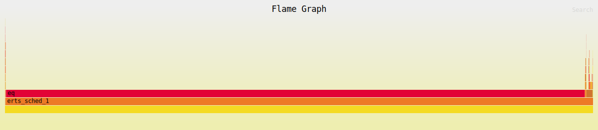
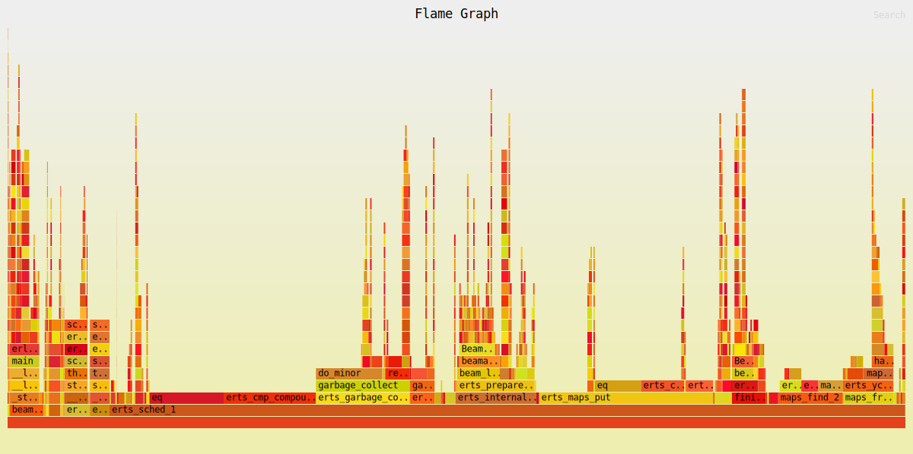

I'm doing Advent of Code in Gleam this year, and my Day 4, Part 2 solution has
by far the longest runtime so far.

About 36 seconds on Erlang, and 100x that on JavaScript.

```
❯ hyperfine -- 'gleam run'
Benchmark 1: gleam run
  Time (mean ± σ):     36.096 s ±  0.318 s    [User: 36.195 s, System: 0.162 s]
  Range (min … max):   35.744 s … 36.593 s    10 runs

❯ hyperfine -- 'gleam run --target javascript --runtime bun'
Benchmark 1: gleam run --target javascript --runtime bun
  Time (mean ± σ):     3350.699 s ± 80.544 s    [User: 3403.290 s, System: 139.388 s]
  Range (min … max):   3220.262 s … 3530.858 s    10 runs
```


Beside the obvious, my `O(n³)` algorithm, whats making this so slow? `perf` can help us find out.

---

We can't hook `perf` directly into `gleam run`, we have to run the generated Erlang code directly.

```
gleam build
erl -pa build/dev/erlang/*/ebin -eval 'aoc2025:main().' -noshell -s init stop
```


Now, to record the performance; Erlang has great documentation on this - [Linux perf support](https://www.erlang.org/doc/apps/erts/beamasm#linux-perf-support).


```
perf record --call-graph=fp \
    -- erl +JPperf true +S 1 \
    -pa build/dev/erlang/*/ebin \
    -eval 'aoc2025:main().' \
    -noshell -s init stop
```

And view it via `perf report -g`, to generate a flame graph, replace `pref
record --call-graph=fp` with
[`flamegraph`](https://github.com/flamegraph-rs/flamegraph). Likewise, you can
use [`samply record`](https://github.com/mstange/samply) to use Firefox as the UI.





From the TUI report (via `perf report -g`), most of the time is spent in `eq` via `list.contains`.

```
- 98.16% $day4:can_move/2
  - 91.11% $'gleam@list':filter_loop/3
    - 80.83% $'gleam@list':contains/2
        69.62% eq
```

And the relevant gleam code:

```gleam
pub fn can_move(roll: Roll, grid: List(Roll)) -> Bool {
  let offsets = [
    #(-1, -1),
    #(-1, 0),
    #(-1, 1),
    #(0, -1),
    #(0, 1),
    #(1, -1),
    #(1, 0),
    #(1, 1),
  ]

  let neigbors =
    offsets
    |> list.map(shift_roll(roll, _))
    |> list.filter(list.contains(grid, _))

  list.length(neigbors) < 4
}

```

So, the easy fix is to use a set instead of a list. 

And looking at hyperfine, it significantly spead up the process:

```
❯ hyperfine -- 'gleam run'
Benchmark 1: gleam run
  Time (mean ± σ):     702.5 ms ±  15.0 ms    [User: 943.2 ms, System: 179.2 ms]
  Range (min … max):   680.0 ms … 730.8 ms    10 runs

❯ hyperfine -- 'gleam run --target javascript --runtime bun'
Benchmark 1: gleam run --target javascript --runtime bun
  Time (mean ± σ):      5.292 s ±  0.085 s    [User: 5.650 s, System: 0.384 s]
  Range (min … max):    5.209 s …  5.463 s    10 runs
```

And perf no longer shows the massive amount of time spent in `eq`.




